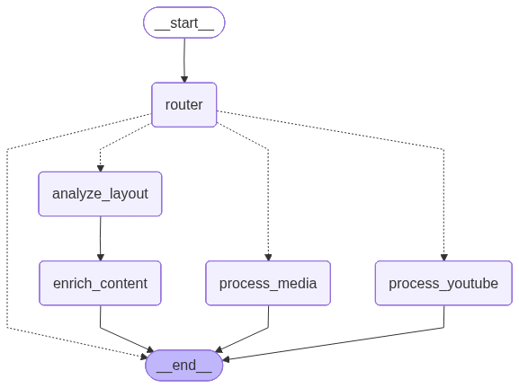

# Student Drive Multimodal RAG Assistant


## 📖 Executive Summary

This project is a **production-grade Multimodal Retrieval-Augmented Generation (RAG) system** engineered to ingest, analyze, and synthesize heterogeneous academic content. Unlike standard RAG systems that treat documents as plain text strings, this engine implements a **semantic vision pipeline**. It "sees" documents the way humans do—distinguishing between layout elements, handwriting, data tables, and diagrams—before serializing them into a vector space.

The system connects a **Google Drive Knowledge Base** (PDFs, Docs, Slides, Images, Scans, Videos, Audio, Youtube) to a **LangGraph Reasoning Engine**, allowing students to query their course materials with zero-hallucination, citation-backed answers.

---

## 🏗 System Architecture

The architecture is visualized in two distinct pipelines: The **RAG Ingestion Pipeline** (Data Processing) and the **Chat Reasoning Pipeline** (Inference).

### 1. The RAG Ingestion Pipeline


*Visual representation of the ETL process from Google Drive to Vector Storage.*

The system is architected as a modular pipeline driven by an event-based orchestrator.

#### **A. The Trigger Layer (n8n Automation)**
We utilize **n8n** workflows to create a reactive link between Google Drive and our GPU Server.
* **Event-Driven:** Detects `file.uploaded` or `file.deleted` events in the connected Drive folder in real-time.
* **Webhook Dispatch:** Instantly triggers the Python Ingestion Engine via secure API endpoints (`/process-document`), ensuring the vector database (`ChromaDB`) is always perfectly synced with Drive without manual intervention.

#### **B. The Ingestion Engine (The "Heavy Lifter")**
A multimodal processing pipeline running on **NVIDIA CUDA**.
* **Worker Swarm:** A `WorkerManager` dynamically distributes tasks to specialized processing units based on content type.
* **Semantic Chunking:** Text is aggregated and split based on semantic coherence rather than arbitrary character counts.

### 2. The Chat Reasoning Pipeline


*Visual representation of the LangGraph cyclic state machine.*

#### **The Cognitive Core (LangGraph)**
We moved beyond linear chains to a **Cyclic State Graph** that acts as the cognitive control unit.
* **State Management:** Maintains conversation history, user roles, and tool outputs in a unified `AgentState`.
* **Dynamic Routing:** The `route_model_output` logic inspects the agent's decision.
    * **Content Query:** Routes to `search_knowledge_base`.
    * **TA Action:** Routes to `ingest_youtube_video` or `update_knowledge_chunk`.
    * **Completion:** Routes to `END` to stream the response.
* **Role-Based System Prompts:** Injects strict constraints based on user roles (TA vs. Student) fetched from **Firebase Auth**.

### 3. The UI Layer (Flutter Web)
A lightweight, reactive frontend for interaction.
* **Repo:** [Student-Drive-Multimodal-RAG-Assistant](https://github.com/AbdelrahmanAtef01/Student-Drive-Multimodal-RAG-Assistant)
---

## 🛠 Technical Deep Dive: The Multimodal Pipeline

This is where the engineering excellence lies. We do not use off-the-shelf parsers. We built a custom **Layout-Aware Ingestion Pipeline**.

### 👁️ Layout Analysis & OCR Engine
We treat every document page as an image first.
* **PDF/Docs/Slides:** Converted to high-res images via `Poppler`.
* **Handwriting Recognition:**
    * **Detection:** Custom YOLOv8 / Roboflow model (`handwritten-text-detection-g7gyl`).
    * **Recognition:** Hybrid approach using **RapidOCR** and **PaddleOCR** for robust text extraction from scribbled notes.
    * **Correction:** Using `gemini-2.5-flash` to correct some words after the OCR worker to make the stored knowledge as accurate as possible.

### 🖼️ Vision-Language Processing (VLM)
Visual elements are not ignored. They are captioned to make them searchable.
* **Model:** `Florence-2-large-ft` running on CUDA.
* **Task:** Generates detailed descriptive captions for charts, diagrams, and photos found in slides or textbooks.

### 📊 Structural Table Extraction
Tables are notorious for breaking RAG systems. We solve this by reconstructing them.
* **Detection:** `microsoft/table-transformer-detection`.
* **Structure Recognition:** `microsoft/table-transformer-structure-recognition`.
* **Pipeline:** The system detects table bounding boxes, crops them, identifies rows/columns, and reconstructs the data into **Markdown Tables** for LLM readability.

### 🎙️ Audio & Video Intelligence (The Engine)
We treat audio streams as first-class citizens in our data layer.
* **Model:** `large-v3` (Whisper) on CUDA for maximum throughput.
* **Pipeline Logic:**
    * **Extraction:** High-fidelity audio extraction from video containers via `ffmpeg`.
    * **Diarization:** Speaker separation logic to distinguish between "Professor" and "Student" voices (where applicable).
    * **Timestamping:** Every transcribed sentence is tagged with accurate start/end timestamps to enable "Deep Linking" in the frontend.

---

## 🧠 TA Tools & Correction Mechanism

The system features a set of specialized **LangGraph Tools** available exclusively to Teaching Assistants (TAs) and Admins.

### `ingest_youtube_video`
A specialized tool allowing TAs to rapidly expand the course curriculum with external resources.
* **Trigger:** TA provides a YouTube URL via chat.
* **Process:**
    1.  **Check Transcribtion:** System Checks if the video transcribtion is available to download directly.
    1.  **Download:** If not, system performs a headless download of the audio track.
    2.  **Pipeline Injection:** The audio is injected into the **Audio & Video Intelligence** engine described above.
    3.  **Indexing:** The resulting transcript is embedded and indexed in ChromaDB with `source: youtube` metadata.

### `update_knowledge_chunk`
RAG systems can sometimes index incorrect information. We solved this with a surgical update tool.
1.  **Identification:** TA notices an error in the AI's answer.
2.  **Trace:** The system retrieves the exact `chunk_id` used for that answer from its previous reasoning.
3.  **Correction:** TA issues a natural language command (e.g., *"Update lab 2 to say the deadline is May 5th"*).
4.  **Re-Embedding:** The system locates the chunk in **ChromaDB**, replaces the text, and **re-calculates the embedding vector** in real-time using `models/text-embedding-004`.

---

## 📂 Project Structure

```bash
├── 📁 workers/                  # The Specialist Swarm
│   ├── audio_worker.py          # Whisper audio transcription
│   ├── ocr_worker.py            # RapidOCR/PaddleOCR Wrapper
│   ├── table_worker.py          # Table Transformer Logic
│   ├── vlm_worker.py            # Florence-2 VLM Captioning
│   └── post_ocr_worker.py       # gemini-2.5-flash cleaning
├── pipeline_orchestrator.py     # DAG Manager for ingestion tasks
├── layout_engine.py             # Page Segmentation Logic
├── drive_processor.py           # Handle Files and Binaries With Google Drive 
├── workflow.py                  # LangGraph State Definitions
├── visualize_graphs.py          # Debugger Graph
├── server.py                    # FastAPI Ingestion Node
├── chat_server.py               # FastAPI Inference Node
├── worker_manager.py            # Thread-safe Worker Distributor
├── vector_store.py              # ChromaDB & Embedding Logic
├── firebase_manager.py          # Firestore Metadata Handler
├── requirements.txt             # Frozen Dependencies
└── Dockerfile                   # CUDA-Optimized Build
```
---
## ⚙️ Configuration & Environment

To run this system, you need a robust `.env` configuration and specific security credentials.

### 🔑 Required Credentials
**IMPORTANT:** You must manually add the following files to the `credentials/` directory (these are git-ignored for security):

1.  **`service_account.json`**: Your Google Cloud Service Account key.
    * *Required Permissions:* Google Drive API, Vertex AI User.
2.  **`serviceAccountKey.json`**: Your Firebase Admin SDK private key.
    * *Required Permissions:* Firebase Authentication Admin, Cloud Firestore Owner.

### 📄 Environment Variables (`.env`)
Create a `.env` file in the root directory using this template:

**`.env`**
```ini
# --- Core System ---
POPPLER_PATH=/usr/bin  # Linux (or C:\path\to\poppler\bin for Windows dev)

# --- Vision & OCR Models ---
# Roboflow (Handwriting Detection)
ROBOFLOW_API_KEY=your_roboflow_key
HANDWRITING_MODEL_ID=handwritten-text-detection-g7gyl/1
HANDWRITING_MODEL_CONFIDENCE=0.3

# Hugging Face / Microsoft (Tables)
TABLE_MODEL_NAME=microsoft/table-transformer-detection
TABLE_MODEL_ID=microsoft/table-transformer-structure-recognition
TABLE_CONF_THRESHOLD=0.5

# VLM (Image Captioning)
VLM_MODEL_ID=microsoft/Florence-2-large-ft
VLM_DEVICE=cuda

# --- Audio Processing ---
WHISPER_MODEL_SIZE=large-v3
WHISPER_DEVICE=cuda
WHISPER_COMPUTE_TYPE=float16

# --- LLM & Embeddings ---
GEMINI_API_KEY=your_gemini_key
GEMINI_MODEL_ID=gemini-2.5-flash
EMBEDDING_MODEL_ID=models/text-embedding-004

# --- Infrastructure ---
GOOGLE_SERVICE_ACCOUNT_FILE=credentials/service_account.json
FIREBASE_CREDENTIALS=credentials/serviceAccountKey.json
API_SECRET_KEY=your_internal_secret_key
CHROMA_PATH=./chroma_db
```
---
## 🔧 Some Engineering Challenges & Solutions

### 1. The "Table Problem"
**Challenge:** Standard OCR reads tables row-by-row across columns, destroying the semantic structure of data.
**Solution:** We implemented a `TableWorker` that uses a specialized Transformer model to understand grid structures, converting them into Markdown representations that LLMs can parse logically.

### 2. Heterogeneous Context Window
**Challenge:** How to RAG across a video, a handwritten note, and a PDF simultaneously?
**Solution:** The `pipeline_orchestrator.py` normalizes all inputs. Video transcripts, image captions, and table markdown are all treated as "Semantic Documents" with rich metadata (page number, timestamp, source type).

---

*Engineered with precision for the next generation of EdTech.*

